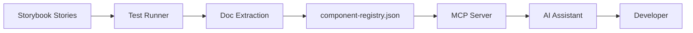
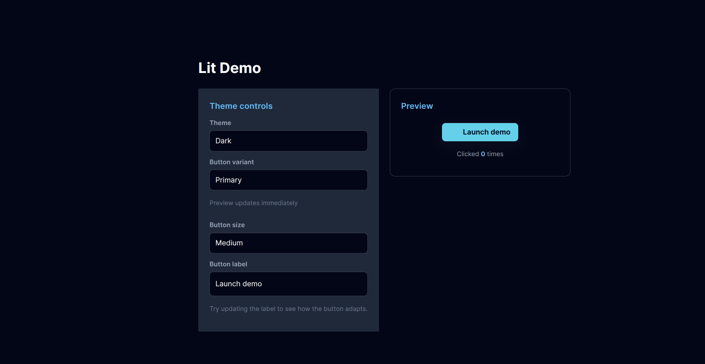
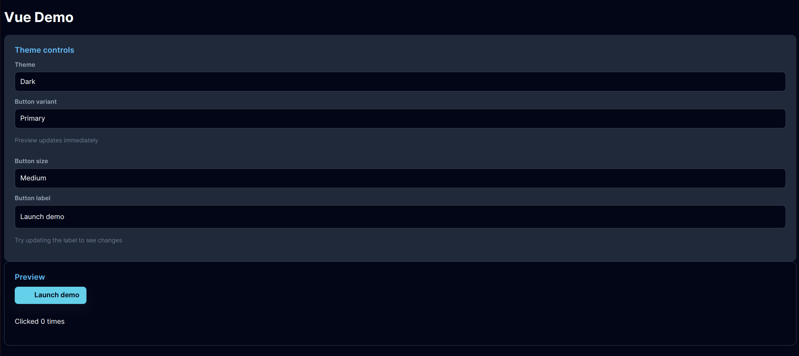
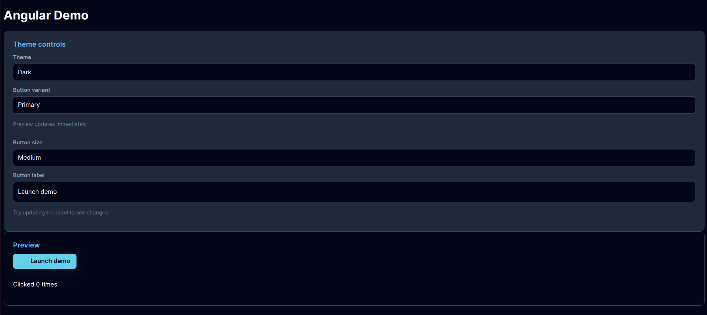

# VG UI Library - Cross-Framework Web Components

> **Proof of Concept**: A single UI library built with LitElement that works seamlessly across all JavaScript frameworks (React, Vue, Angular) and vanilla HTML, powered by Web Components standards and enhanced by LLM-assisted development through MCP integration.

A modern TypeScript-based component library built with Lit 3, featuring a comprehensive design system with theme provider and framework integrations for React, Vue, and Angular. This project demonstrates the power of **"Write Once, Use Everywhere"** with Web Components.

[Storybook,Coverage,and Lighthouse Reports](https://brguru90.github.io/lit-components/) -

## � Table of Contents

- [Features](#-features)
- [Project Overview](#-project-overview)
- [Quick Start for Users](#-quick-start-for-users)
- [Developer Setup](#-developer-setup)
- [Project Structure](#-project-structure)
- [Project Architecture](#-project-architecture)
- [Development Guidelines](#-development-guidelines)
- [MCP Server Integration](#-mcp-server-integration)
- [Framework Demos](#-framework-demos)
- [Storybook Features](#-storybook-features)
- [Testing](#-testing)
- [Pros and Cons](#-pros-and-cons)
- [TODOs and Roadmap](#-todos-and-roadmap)
- [Components Reference](#-components-reference)

## �🚀 Features

- **Modern Architecture**: Built with Lit 3 and TypeScript
- **Design System**: Comprehensive theme provider with multiple theme modes (dark, light, glass, cartoon)
- **Framework Support**: React, Vue, and Angular wrapper components
- **Development Tools**: Vite-powered development with hot reload
- **Custom Elements**: Standards-compliant web components
- **TypeScript**: Full type safety with generated declarations
- **Design Tokens**: CSS custom properties for consistent styling
- **MCP Server**: AI-assisted development with comprehensive documentation access
- **Automated Testing**: Storybook Play Functions with Lighthouse performance audits
- **Cross-Framework Documentation**: Framework switcher in Storybook for multi-framework examples

## 🎯 Project Overview

This project is a **proof of concept** demonstrating how to build a truly universal UI library using Web Components (via LitElement) that can be used across all major JavaScript frameworks with zero lock-in.

### Key Concepts

1. **Single Source of Truth**: Components are built once using LitElement
2. **Web Components Standard**: Leverages native browser APIs for maximum compatibility
3. **Framework Wrappers**: Automatic generation of React, Vue, and Angular wrappers
4. **LLM-Assisted Development**: MCP server provides documentation to AI coding assistants
5. **Automated Documentation**: Extracts component docs from stories for MCP consumption

### Why This Approach?

- ✅ **Write once, use everywhere**: Single codebase for all frameworks
- ✅ **Future-proof**: Based on web standards, not framework-specific APIs
- ✅ **Performance**: Native Shadow DOM and efficient rendering
- ✅ **AI-Enhanced Development**: MCP integration enables rapid development with AI assistants
- ✅ **Consistent behavior**: Same component logic across all frameworks

## 📦 Installation

### From GitHub Repository

```bash
# Direct installation
npm install https://github.com/brguru90/lit-components.git
```

### Via package.json

Add to your `package.json` dependencies:

```json
"dependencies": {
  "vg": "github:brguru90/lit-components"
}
```

Then run:

```bash
npm install
```

## 🚀 Quick Start for Users

### Vanilla HTML/JavaScript

```html
<!DOCTYPE html>
<html>
<head>
  <script type="module" src="./node_modules/vg/dist/index.js"></script>
  <link rel="stylesheet" href="./node_modules/vg/dist/index.css" />
</head>
<body>
  <vg-theme-provider mode="dark">
    <vg-card heading="Welcome">
      <vg-button variant="primary" size="md">Get Started</vg-button>
    </vg-card>
  </vg-theme-provider>

  <script>
    document.querySelector('vg-button').addEventListener('vg-click', (event) => {
      console.log('Button clicked!', event.detail);
    });
  </script>
</body>
</html>
```

### React

```jsx
import { VgThemeProvider, VgButton, VgCard } from "vg/react";
import "vg/index.css";

function App() {
  return (
    <VgThemeProvider mode="dark">
      <VgCard heading="Welcome">
        <VgButton 
          variant="primary" 
          size="md"
          onVgClick={(event) => console.log('Clicked!', event.detail)}
        >
          Get Started
        </VgButton>
      </VgCard>
    </VgThemeProvider>
  );
}
```

### Vue

```vue
<template>
  <vg-theme-provider mode="dark">
    <vg-card heading="Welcome">
      <vg-button 
        variant="primary" 
        size="md"
        @vg-click="handleClick"
      >
        Get Started
      </vg-button>
    </vg-card>
  </vg-theme-provider>
</template>

<script setup>
import "vg/vue";

const handleClick = (event) => {
  console.log('Clicked!', event.detail);
};
</script>
```

### Angular

```typescript
// app.component.ts
import { Component, CUSTOM_ELEMENTS_SCHEMA } from '@angular/core';

@Component({
  selector: 'app-root',
  template: `
    <vg-theme-provider mode="dark">
      <vg-card heading="Welcome">
        <vg-button 
          variant="primary" 
          size="md"
          (vg-click)="handleClick($event)"
        >
          Get Started
        </vg-button>
      </vg-card>
    </vg-theme-provider>
  `,
  schemas: [CUSTOM_ELEMENTS_SCHEMA]
})
export class AppComponent {
  handleClick(event: Event) {
    console.log('Clicked!', (event as CustomEvent).detail);
  }
}
```

```typescript
// main.ts
import { bootstrapApplication } from '@angular/platform-browser';
import { AppComponent } from './app/app.component';
import "vg";

bootstrapApplication(AppComponent);
```

## 🧩 Components Reference

### Theme Provider
Controls the design system theme and provides CSS custom properties.

```html
<vg-theme-provider mode="dark">
  <!-- Your components here -->
</vg-theme-provider>
```

**Props:**
- `mode`: `"dark" | "light" | "glass" | "cartoon"` - Theme mode

**Events:**
- `vg-change` - Emitted when theme changes

### Button
Versatile button component with multiple variants and sizes.

```html
<vg-button variant="primary" size="md" disabled>Click me</vg-button>
```

**Props:**
- `variant`: `"primary" | "secondary" | "ghost"` - Button style variant
- `size`: `"sm" | "md" | "lg"` - Button size
- `disabled`: `boolean` - Disable the button

**Events:**
- `vg-click` - Emitted when button is clicked

### Card
Container component with optional header and footer slots.

```html
<vg-card heading="Card Title" variant="outlined">
  <p>Card content goes here</p>
  <div slot="footer">
    <vg-button>Action</vg-button>
  </div>
</vg-card>
```

**Props:**
- `heading`: `string` - Card header text
- `variant`: `"default" | "outlined" | "subtle"` - Card style variant

**Slots:**
- Default slot - Main card content
- `footer` - Footer content area

### Input
Text input component with label and helper text support.

```html
<vg-input 
  label="Email" 
  placeholder="Enter your email"
  helper-text="We'll never share your email"
  required
></vg-input>
```

**Props:**
- `label`: `string` - Input label
- `placeholder`: `string` - Placeholder text
- `helper-text`: `string` - Helper text below input
- `value`: `string` - Input value
- `disabled`: `boolean` - Disable the input
- `required`: `boolean` - Mark as required

**Events:**
- `vg-change` - Emitted when input value changes

### Dropdown
Select dropdown with rich option support.

```html
<vg-dropdown 
  label="Choose option"
  placeholder="Select..."
  helper-text="Pick your favorite"
></vg-dropdown>
```

**Props:**
- `label`: `string` - Dropdown label
- `placeholder`: `string` - Placeholder text
- `helper-text`: `string` - Helper text
- `options`: `DropdownOption[]` - Array of options
- `value`: `string` - Selected value
- `disabled`: `boolean` - Disable the dropdown
- `required`: `boolean` - Mark as required

**Events:**
- `vg-change` - Emitted when selection changes

## 💻 Developer Setup

This section is for developers who want to contribute to or modify the VG UI Library.

### Prerequisites

- **Node.js**: Version 16 or higher
- **npm**: Version 7 or higher
- **Python**: Version 3.13+ (for MCP server development)
- **uv**: Python package manager (for MCP server)
- **Git**: For version control

### Initial Setup

1. **Clone the repository**:
   ```bash
   git clone <repository-url>
   cd lit-components
   ```

2. **Install dependencies**:
   ```bash
   npm install
   ```

3. **Install demo dependencies** (optional):
   ```bash
   npm run install-demos
   ```

4. **Setup MCP server** (optional, for AI-assisted development):
   ```bash
   cd mcp
   uv sync
   cd ..
   ```

### Development Commands

```bash
# Start development server with hot reload
npm run dev

# Build the library
npm run build-module

# Type check
npm run type-check

# Generate custom elements manifest and framework wrappers
npm run lsp-support

# Full release build (includes manifest generation and version bump)
npm run release

# Run Storybook for component development
npm run storybook

# Build Storybook
npm run build-storybook

# Run Storybook tests
npm run test

# Extract documentation for MCP
npm run docs:build

# Run Lighthouse audits
npm run lighthouse

# Run all framework demos
npm run demo
```

### Development Workflow

1. **Component Development**:
   - Create new component in `src/components/ComponentName/`
   - Implement `index.ts` with LitElement class
   - Add styles in `style.scss`
   - Export component from `src/index.ts`

2. **Story Creation**:
   - Create story file in `stories/ComponentName.stories.ts`
   - Add examples and documentation
   - Include Play Functions for testing
   - Run Storybook to preview: `npm run storybook`

3. **Testing**:
   - Write Play Functions in story files
   - Run tests: `npm run test`
   - Lighthouse audits run automatically during tests

4. **Building**:
   - Build library: `npm run build-module`
   - Generate manifests: `npm run lsp-support`
   - Or do both: `npm run release_test`

5. **Update Demos**:
   - After building, update demos: `npm run update-demos`
   - Test in all frameworks: `npm run demo`

### Project File Structure

```
lit-components/
├── src/                              # Source code
│   ├── components/                   # Component implementations
│   │   ├── Button/
│   │   │   ├── index.ts             # Component class
│   │   │   └── style.scss           # Component styles
│   │   ├── Card/
│   │   ├── Dropdown/
│   │   ├── Input/
│   │   └── ThemeProvider/
│   ├── styles/                       # Global styles and tokens
│   │   ├── tokens.scss              # Design tokens
│   │   └── themes/                  # Theme definitions
│   ├── index.ts                      # Main entry point
│   └── my-element.ts                 # Development playground
│
├── stories/                          # Storybook stories
│   ├── Button.stories.ts
│   ├── Card.stories.ts
│   └── ...
│
├── .storybook/                       # Storybook configuration
│   ├── main.ts                      # Storybook main config
│   ├── preview.ts                   # Global decorators/parameters
│   ├── test-runner.ts               # Test runner config (Lighthouse + docs extraction)
│   ├── themes/                      # Theme toggle implementation
│   └── utils/
│       ├── framework-transformer.ts # Framework code switcher
│       ├── documentation-extraction.ts
│       └── test-runner-utils.ts     # Lighthouse utilities
│
├── demo/                             # Framework demos
│   ├── html-demo/                   # Vanilla HTML/JS
│   ├── react-demo/                  # React 18
│   ├── react19-demo/                # React 19
│   ├── vue-demo/                    # Vue 3
│   └── anguler-demo/                # Angular
│
├── mcp/                              # MCP Server
│   ├── src/vg_ui_lib_mcp/
│   │   └── main.py                  # MCP server implementation
│   ├── pyproject.toml               # Python project config
│   └── README.md                    # MCP documentation
│
├── dist/                             # Build output
│   ├── index.js                     # Main bundle
│   ├── index.css                    # Styles
│   ├── custom-elements.json         # Component manifest
│   ├── react/                       # React wrappers
│   ├── vue/                         # Vue integration
│   └── jsx/                         # JSX types
│
├── storybook-static/                 # Built Storybook
│   └── stories_doc/                 # Extracted documentation
│       └── component-registry.json  # MCP component data
│
├── types/                            # TypeScript declarations
├── scripts/                          # Build and utility scripts
│   ├── fix.js                       # Post-build fixes
│   ├── update-demos.js              # Update demo dependencies
│   └── create-lhci-project.js       # Lighthouse CI setup
│
├── docs/                             # Documentation
│   ├── FRAMEWORK_SWITCHER.md
│   ├── PLAY_FUNCTION_TESTING.md
│   ├── LIGHTHOUSE_*.md
│   └── ...
│
├── package.json                      # Project dependencies
├── vite.config.ts                   # Dev server config
├── vite-module.config.ts            # Library build config
├── tsconfig.json                    # TypeScript config
├── tsconfig-module.json             # Library TypeScript config
└── custom-elements-manifest.config.mjs  # Manifest generation config
```

## 🎨 Theming

The library includes a comprehensive design system with CSS custom properties:

```css
:root {
  --vg-font-family-base: 'Inter', 'Segoe UI', sans-serif;
  --vg-font-size-sm: 0.875rem;
  --vg-font-size-md: 1rem;
  --vg-font-size-lg: 1.125rem;
  --vg-spacing-sm: 0.75rem;
  --vg-spacing-md: 1rem;
  --vg-spacing-lg: 1.5rem;
  --vg-text-color: #ffffff;
  --vg-background-color: #1a1a1a;
  /* ... and many more */
}
```

### Theme Modes
- **Dark**: Default dark theme with high contrast
- **Light**: Clean light theme for bright environments
- **Glass**: Modern glassmorphism effect with backdrop blur
- **Cartoon**: Playful theme with increased letter spacing


## 📋 Event System

All components follow a consistent event naming convention:
- Events are prefixed with `vg-` (e.g., `vg-click`, `vg-change`)
- Framework wrappers convert to appropriate conventions:
  - React: `onVgClick`, `onVgChange`
  - Angular: `(vg-click)`, `(vg-change)`
  - Vue: `@vg-click`, `@vg-change`

## 🏗️ Project Architecture

### Technology Stack

- **Core Framework**: [Lit 3](https://lit.dev/) - Fast, lightweight web components
- **Language**: TypeScript with strict type checking
- **Build Tool**: Vite for fast development and optimized builds
- **Styling**: SCSS with CSS custom properties for theming
- **Documentation**: Storybook with MDX stories
- **Testing**: Storybook Test Runner with Jest and Lighthouse
- **Package Management**: npm with workspaces for demos
- **MCP Server**: FastMCP (Python) for AI integration

### Component Architecture

Each component follows this structure:

```typescript
import { LitElement, html, css } from 'lit';
import { customElement, property } from 'lit/decorators.js';

@customElement('vg-component-name')
export class VgComponentName extends LitElement {
  // 1. Static styles (scoped to shadow DOM)
  static styles = css`
    :host {
      display: block;
    }
  `;

  // 2. Reactive properties
  @property({ type: String })
  variant: 'primary' | 'secondary' = 'primary';

  @property({ type: Boolean })
  disabled = false;

  // 3. Lifecycle methods (if needed)
  connectedCallback() {
    super.connectedCallback();
  }

  // 4. Event handlers
  private handleClick() {
    this.dispatchEvent(new CustomEvent('vg-click', {
      detail: { variant: this.variant },
      bubbles: true,
      composed: true,
    }));
  }

  // 5. Render method
  render() {
    return html`
      <button 
        ?disabled=${this.disabled}
        @click=${this.handleClick}
      >
        <slot></slot>
      </button>
    `;
  }
}
```

### Build Pipeline

1. **Component Development**: Write LitElement components in `src/components/`
2. **TypeScript Compilation**: `tsc` compiles to JavaScript
3. **Vite Bundling**: Bundles all components with tree-shaking
4. **Manifest Generation**: `custom-elements-manifest` analyzes components
5. **Wrapper Generation**: Automatically creates React, Vue, Angular wrappers
6. **Documentation Extraction**: Storybook tests extract structured docs
7. **MCP Integration**: Component registry is packaged with MCP server

### Custom Elements Manifest

The `custom-elements-manifest.config.mjs` file orchestrates:

- **Type Analysis**: Extracts TypeScript types for props and events
- **JSDoc Tags**: Processes custom tags like `@figma` and `@github`
- **Framework Wrappers**: 
  - `custom-element-react-wrappers`: React components
  - `custom-element-vuejs-integration`: Vue types
  - `customElementVsCodePlugin`: VS Code IntelliSense
- **Event Renaming**: Vue-specific event name transformations

### Storybook Integration

```
Story Creation → Documentation → Testing → Performance Audit
     ↓              ↓              ↓              ↓
  stories/      MDX Docs     Play Functions   Lighthouse
```

1. **Stories**: Define component examples with args
2. **Documentation**: Auto-generated from component manifest
3. **Framework Switcher**: Transforms code examples for each framework
4. **Play Functions**: Interactive tests for user interactions
5. **Lighthouse**: Performance audits for each story
6. **Doc Extraction**: Structured JSON for MCP consumption

### MCP Server Architecture

```
Storybook Tests → Extract Docs → Component Registry → MCP Server → AI Assistant
                                         ↓
                          component-registry.json
```

- **Data Source**: `storybook-static/stories_doc/component-registry.json`
- **Server**: FastMCP Python server with 14 tools
- **Consumers**: GitHub Copilot, Claude, other AI assistants
- **Purpose**: Provides component docs, schemas, examples, and CSS to AI

## 📝 Development Guidelines

### Component Development Rules

1. **Naming Conventions**:
   - Component class: `VgComponentName` (PascalCase)
   - Custom element tag: `vg-component-name` (kebab-case)
   - File structure: `src/components/ComponentName/index.ts`

2. **Properties**:
   ```typescript
   // ✅ Good: Use decorators with types
   @property({ type: String, reflect: true })
   variant: 'primary' | 'secondary' = 'primary';

   // ❌ Bad: No type information
   @property()
   variant = 'primary';
   ```

3. **Events**:
   - Prefix all custom events with `vg-`
   - Use `CustomEvent` with typed `detail`
   - Set `bubbles: true, composed: true` for cross-boundary events
   ```typescript
   this.dispatchEvent(new CustomEvent('vg-change', {
     detail: { value: this.value },
     bubbles: true,
     composed: true,
   }));
   ```

4. **Styling**:
   - Use Shadow DOM for style encapsulation
   - Define CSS custom properties for themeable values
   - Provide sensible defaults
   ```scss
   :host {
     --button-bg: var(--vg-primary-color, #007bff);
     background: var(--button-bg);
   }
   ```

5. **Slots**:
   - Always document slot names and purposes
   - Provide default content when appropriate
   ```typescript
   render() {
     return html`
       <div class="header">
         <slot name="header">Default Header</slot>
       </div>
       <slot></slot>
     `;
   }
   ```

### Storybook Story Guidelines

1. **Story Structure**:
   ```typescript
   import type { Meta, StoryObj } from '@storybook/web-components';
   import { html } from 'lit';
   import '../src/components/Button';

   const meta: Meta = {
     title: 'Components/Button',
     component: 'vg-button',
     tags: ['autodocs'],
     argTypes: {
       variant: {
         control: 'select',
         options: ['primary', 'secondary', 'ghost'],
       },
     },
   };

   export default meta;
   type Story = StoryObj;

   export const Primary: Story = {
     args: {
       variant: 'primary',
     },
     render: (args) => html`
       <vg-button variant=${args.variant}>
         Click Me
       </vg-button>
     `,
   };
   ```

2. **Play Functions** (Testing):
   - Test user interactions
   - Verify visual states
   - Check event emissions
   ```typescript
   import { expect, userEvent, within } from '@storybook/test';

   export const Interactive: Story = {
     play: async ({ canvasElement }) => {
       const canvas = within(canvasElement);
       const button = canvas.getByRole('button');
       
       // Test interaction
       await userEvent.click(button);
       await expect(button).toHaveAttribute('aria-pressed');
     },
   };
   ```

3. **Documentation**:
   - Include meaningful descriptions
   - Show multiple variants
   - Demonstrate slot usage
   - Document edge cases

### Testing Guidelines

1. **Unit Tests** (Play Functions):
   - Test component behavior, not implementation
   - Focus on user interactions
   - Verify accessibility features
   - Test responsive behavior

2. **Visual Tests**:
   - Verify layout across different viewports
   - Test theme switching
   - Check component states (hover, focus, disabled)

3. **Performance Tests** (Lighthouse):
   - Target scores: Performance > 90, Accessibility > 90
   - Keep component size minimal
   - Optimize images and assets

### Code Quality Standards

1. **TypeScript**:
   - Enable strict mode
   - Avoid `any` type
   - Provide explicit return types
   - Use type guards for runtime checks

2. **Accessibility**:
   - Include ARIA attributes
   - Support keyboard navigation
   - Provide focus indicators
   - Test with screen readers

3. **Performance**:
   - Minimize re-renders
   - Use event delegation
   - Lazy load heavy components
   - Optimize CSS selectors

4. **Documentation**:
   - Add JSDoc comments for all public APIs
   - Include usage examples
   - Document breaking changes
   - Update README for new features

## 🤖 MCP Server Integration

The VG UI Library includes a Model Context Protocol (MCP) server that provides comprehensive component documentation to AI coding assistants like GitHub Copilot and Claude.

### What is MCP?

MCP (Model Context Protocol) is a standardized way to provide context to Large Language Models (LLMs). The VG MCP server exposes component documentation, schemas, examples, and CSS information through a set of tools that AI assistants can query.

### Features

- **14 Comprehensive Tools**: Search, list, analyze components and schemas
- **Framework-Specific Examples**: Filter examples by framework (React, Vue, Angular, etc.)
- **Live Documentation**: Auto-generated from Storybook stories
- **Type Definitions**: Full TypeScript schema access
- **CSS Variables**: Categorized styling information
- **Component Relationships**: Analyze dependencies and hierarchy

### Setup for VS Code

1. **Build the Component Registry**:
   ```bash
   # Build Storybook and extract documentation
   npm run build-storybook
   npm run docs:build
   ```

2. **Install the MCP Server**:
   ```bash
   cd mcp
   uv build
   uv tool install dist/*.whl
   ```

3. **Configure VS Code**:
   
   Create or edit `.vscode/mcp.json` in your project:
   ```json
   {
     "servers": {
       "vg-ui-lib-mcp": {
         "type": "stdio",
         "command": "uvx",
         "args": [
           "vg-ui-lib-mcp-server",
           "--use-framework",
           "react19"
         ]
       }
     }
   }
   ```

4. **Verify Installation**:
   - Restart VS Code
   - GitHub Copilot can now access VG component documentation
   - Ask questions like "How do I use vg-button?" or "Show me vg-card examples"

### Setup for Claude Desktop

1. **Install the MCP Server** (same as above)

2. **Configure Claude**:
   ```bash
   # Add to Claude Desktop configuration
   claude mcp add -s user vg-ui-lib-mcp-server vg-ui-lib-mcp-server
   
   # Or with framework filter
   claude mcp add -s user vg-ui-lib-mcp-server vg-ui-lib-mcp-server --use-framework react
   ```

3. **Use in Claude**:
   - Claude can now query VG component documentation
   - Ask for examples, props, events, and usage patterns

### MCP Development Mode

For MCP server development with debugging:

```bash
cd mcp

# Install with dev dependencies
uv sync --extra dev

# Run with MCP Inspector (interactive debugging)
uv run vg-ui-lib-mcp-dev

# Or use FastMCP dev mode directly
uv run fastmcp dev src/vg_ui_lib_mcp/main.py
```

The MCP Inspector provides:
- 🔍 Interactive tool testing
- 📊 Real-time request/response monitoring
- 🐛 Enhanced debug logging
- 📈 Performance metrics

### Available MCP Tools

#### Component Discovery
- `list_components` - List all components with metadata
- `search_components` - Search by name/description/category
- `get_component_by_tag` - Get detailed component info
- `get_component_properties` - Get all props for a component
- `get_component_events` - Get all events for a component

#### Documentation Access
- `get_component_examples` - Get usage examples (framework-filtered)
- `get_component_slots` - Get slot information
- `get_component_css_properties` - Get CSS custom properties

#### Schema & Type Information
- `get_schema_by_name` - Get JSON schemas
- `list_schemas` - List all available schemas

#### Analysis Tools
- `get_components_by_category` - Filter by category
- `list_categories` - List all categories
- `analyze_component_relationships` - Component hierarchy analysis
- `get_component_usage_stats` - Usage statistics

### How It Works



1. **Story Creation**: Developers write Storybook stories with examples
2. **Test Execution**: `npm run test` runs stories and Play Functions
3. **Doc Extraction**: `.storybook/utils/documentation-extraction.ts` extracts structured data
4. **Registry Generation**: `npm run docs:build` merges all documentation
5. **MCP Server**: Python FastMCP server exposes tools to query the registry
6. **AI Integration**: Copilot/Claude uses MCP tools to answer developer questions

### Benefits for Development

- **Faster Onboarding**: AI assistants help new developers learn the library
- **Consistent Usage**: AI suggests correct patterns from official examples
- **Up-to-Date Docs**: Documentation automatically syncs with code changes
- **Framework Agnostic**: Get examples for your specific framework
- **Type Safety**: Full TypeScript definitions available to AI

### Troubleshooting

**MCP Server Not Found**:
```bash
# Check if installed
uv tool list

# Reinstall
cd mcp
uv tool uninstall vg-ui-lib-mcp-server
uv build
uv tool install dist/*.whl
```

**Documentation Not Updated**:
```bash
# Rebuild documentation
npm run build-storybook
npm run docs:build

# Verify registry exists
ls -la storybook-static/stories_doc/component-registry.json
```

**AI Not Using MCP**:
- Restart VS Code or Claude Desktop
- Check MCP configuration is valid JSON
- Verify `uvx` command is in system PATH
- Check MCP logs for errors

For detailed MCP documentation, see [mcp/README.md](./mcp/README.md).

## � Storybook Features

### Framework Switcher

Our Storybook includes a unique **Framework Switcher** feature that demonstrates the true power of Web Components - **write once, use anywhere**!

When viewing component documentation in Storybook, you can select your preferred framework from the toolbar, and the code examples automatically transform to show the appropriate syntax:

- 📄 **HTML**: Vanilla Web Components with event listeners
- ⚛️ **React**: JSX with React wrapper components
- 🟢 **Vue**: Single File Components with Composition API
- 🅰️ **Angular**: Component classes with templates
- 🔥 **Lit**: LitElement with decorators

**Example**: The same button story shows different code for each framework:

```bash
# Start Storybook
npm run storybook
```

Then in the toolbar, select: `Framework: [React ▾]` to see React code, or `Framework: [Vue ▾]` for Vue code, etc.

This feature helps developers:
- ✅ Copy-paste ready code for their framework
- ✅ Understand how to integrate components in their specific environment  
- ✅ Learn Web Component patterns across frameworks
- ✅ Reduce onboarding friction

For detailed documentation, see [Framework Switcher Documentation](./docs/FRAMEWORK_SWITCHER.md)

### Play Function Testing

Our components include **interactive tests** that validate behavior across ALL frameworks with a single test suite!

**Key Benefits:**
- ✅ **Universal Testing**: One Play Function test validates React, Vue, Angular, HTML, and Lit
- ✅ **Real Interactions**: Tests actual user interactions (clicks, typing, keyboard navigation)
- ✅ **Framework-Agnostic**: Tests the web component itself, not the framework wrapper
- ✅ **Visual Debugging**: Watch tests run live in Storybook's Interactions panel
- ✅ **CI/CD Ready**: Automated testing with `npm run test-storybook`

**Why It Works:**
Web components render the same shadow DOM regardless of framework wrapper, so Play Functions test the universal component behavior that works identically across all frameworks.

```bash
# View interactive tests in Storybook
npm run storybook
# Navigate to: Components/Button/Interaction Tests

# Run automated tests
npm run test-storybook
```

**Quick Example:**
```typescript
export const ClickTest: Story = {
  play: async ({ canvasElement }) => {
    const canvas = within(canvasElement)
    const button = canvas.getByRole('button')
    
    await userEvent.click(button)
    await expect(button).toBeInTheDocument()
  }
}
```

This single test validates the button works correctly in React, Vue, Angular, HTML, and Lit!

For detailed documentation, see:
- [Play Function Testing Guide](./docs/PLAY_FUNCTION_TESTING.md) - Comprehensive documentation
- [Quick Start Guide](./docs/PLAY_FUNCTION_QUICKSTART.md) - Get started in 5 minutes

## 🧪 Framework Demos

Run all demo applications simultaneously:

```bash
npm run demo
```

Individual demos:
- **HTML**: `npm run start --prefix demo/html-demo` (Port 4000)
- **React**: `npm run start --prefix demo/react-demo` (Port 3000)  
- **Vue**: `npm run dev --prefix demo/vue-demo` (Port 5173)
- **Angular**: `npm run start --prefix demo/angular-demo` (Port 4200)

## � Demo Screenshots

Here's how the component library looks across different frameworks:

### Lit Playground


### HTML/Vanilla JavaScript


### React Integration


### Vue Integration


### Angular Integration


All demos showcase the same components with consistent theming and functionality across frameworks, demonstrating the library's versatility and framework-agnostic design.

## ⚖️ Pros and Cons

### Advantages ✅

1. **True Framework Independence**
   - Write components once, use in React, Vue, Angular, or vanilla HTML
   - No framework lock-in or migration risks
   - Future-proof: based on Web Standards

2. **Smaller Bundle Sizes**
   - Web Components are native to browsers
   - No framework runtime overhead (React, Vue, etc.)
   - Tree-shakeable with modern bundlers

3. **Better Performance**
   - Native Shadow DOM for style encapsulation
   - Efficient rendering with Lit's template caching
   - Minimal JavaScript footprint

4. **Consistent Behavior**
   - Same component logic across all frameworks
   - Single bug fix applies everywhere
   - Unified testing strategy

5. **AI-Enhanced Development**
   - MCP server provides documentation to AI assistants
   - Faster development with Copilot/Claude integration
   - Automated documentation extraction

6. **Strong TypeScript Support**
   - Full type safety for props and events
   - Auto-generated types for all frameworks
   - IntelliSense in VS Code

7. **Modern Development Experience**
   - Fast Vite dev server with HMR
   - Interactive Storybook with multi-framework examples
   - Automated testing with Play Functions
   - Lighthouse performance monitoring

8. **Interoperability**
   - Can be used alongside other component libraries
   - No conflicts with framework-specific components
   - Easy to adopt incrementally

### Disadvantages ❌

1. **Framework Integration Challenges**
   - React: Requires wrapper components for event handling
   - Angular: Needs `CUSTOM_ELEMENTS_SCHEMA`
   - Two-way binding can be tricky (Vue `v-model`, React controlled components)

2. **Limited Framework-Specific Features**
   - Can't use React Hooks directly
   - No Vue Composition API integration
   - Angular dependency injection not available

3. **Shadow DOM Gotchas**
   - Global styles don't penetrate shadow DOM
   - CSS-in-JS libraries may not work as expected
   - Form participation requires extra work

4. **Smaller Ecosystem**
   - Fewer third-party web component libraries compared to React
   - Less community support and resources
   - Fewer examples and tutorials

5. **Developer Familiarity**
   - Developers may not be familiar with Lit/Web Components
   - Different mental model than React/Vue
   - Learning curve for Shadow DOM and Custom Elements

6. **SSR/SSG Complexity**
   - Server-side rendering requires Declarative Shadow DOM
   - Not all frameworks support SSR for web components
   - Hydration can be challenging

7. **Testing Challenges**
   - Testing tools may not fully support Shadow DOM
   - Need custom test utilities for event handling
   - Framework-specific testing libraries may not work

8. **Build Tooling**
   - Requires specific configuration for each framework
   - Some bundlers may need plugins for web components
   - TypeScript configuration can be complex

### When to Use This Approach ✅

- Building a design system used across multiple frameworks
- Creating reusable components for a multi-framework organization
- Need maximum portability and future-proofing
- Want to minimize framework-specific dependencies
- Building component libraries for public consumption
- Performance is critical (smaller bundles)

### When NOT to Use This Approach ❌

- Building a single-framework application
- Need deep framework integration (hooks, context, etc.)
- Team lacks Web Components experience
- Require extensive SSR/SSG support
- Need mature ecosystem and community support
- Tight deadlines with no time for learning curve

## 📋 TODOs and Roadmap

### Immediate Priorities (v1.0)

- [ ] **Complete Component Coverage**
  - [ ] Add `vg-checkbox` component
  - [ ] Add `vg-radio` component
  - [ ] Add `vg-switch` component
  - [ ] Add `vg-textarea` component
  - [ ] Add `vg-select` (native select wrapper)
  - [ ] Add `vg-dialog` component
  - [ ] Add `vg-tooltip` component
  - [ ] Add `vg-popover` component

- [ ] **Accessibility Improvements**
  - [ ] Complete ARIA attribute coverage
  - [ ] Keyboard navigation testing
  - [ ] Screen reader testing
  - [ ] WCAG 2.1 AA compliance audit
  - [ ] High contrast mode support

- [ ] **Documentation Enhancements**
  - [ ] Add more Play Function tests for all components
  - [ ] Create accessibility documentation
  - [ ] Add more framework-specific examples
  - [ ] Video tutorials for getting started
  - [ ] Migration guides from other libraries

- [ ] **Testing & Quality**
  - [ ] Increase test coverage to 80%+
  - [ ] Add visual regression testing
  - [ ] Cross-browser testing automation
  - [ ] Performance benchmarking
  - [ ] Bundle size monitoring

### Short Term (v1.1-v1.5)

- [ ] **Advanced Components**
  - [ ] `vg-tabs` component
  - [ ] `vg-accordion` component
  - [ ] `vg-table` with sorting/filtering
  - [ ] `vg-pagination` component
  - [ ] `vg-breadcrumb` component
  - [ ] `vg-stepper` component
  - [ ] `vg-tree` component
  - [ ] `vg-menu` / `vg-context-menu`

- [ ] **Form Handling**
  - [ ] Form validation utilities
  - [ ] Error message system
  - [ ] Form state management
  - [ ] Integration with popular form libraries

- [ ] **Layout Components**
  - [ ] `vg-grid` responsive grid system
  - [ ] `vg-stack` spacing utility
  - [ ] `vg-container` max-width wrapper
  - [ ] `vg-divider` component

- [ ] **Theme System**
  - [ ] Theme builder tool
  - [ ] More built-in themes
  - [ ] Dark mode auto-detection
  - [ ] CSS variable documentation generator

- [ ] **Developer Experience**
  - [ ] CLI for scaffolding new components
  - [ ] VS Code extension with snippets
  - [ ] Codemods for migrations
  - [ ] Better error messages

### Medium Term (v2.0)

- [ ] **Framework Improvements**
  - [ ] React 19 concurrent features support
  - [ ] Vue 3.5+ features
  - [ ] Angular Signals integration
  - [ ] Svelte wrapper generation
  - [ ] Solid.js wrapper generation

- [ ] **Advanced Features**
  - [ ] Animation system
  - [ ] Virtual scrolling for lists
  - [ ] Drag and drop utilities
  - [ ] Internationalization (i18n) support
  - [ ] RTL (right-to-left) support

- [ ] **SSR/SSG Support**
  - [ ] Declarative Shadow DOM
  - [ ] Next.js integration guide
  - [ ] Nuxt integration guide
  - [ ] Astro integration guide

- [ ] **Build & Performance**
  - [ ] Optimize bundle size further
  - [ ] Tree-shaking improvements
  - [ ] Code splitting strategies
  - [ ] CDN distribution

- [ ] **MCP Server Enhancements**
  - [ ] Interactive component playground in MCP
  - [ ] AI-generated component variations
  - [ ] Automated accessibility suggestions
  - [ ] Performance optimization recommendations

### Long Term (v3.0+)

- [ ] **Design Tools Integration**
  - [ ] Figma plugin for design tokens
  - [ ] Sketch integration
  - [ ] Design token sync automation

- [ ] **Advanced MCP Features**
  - [ ] Visual component generation from descriptions
  - [ ] Automated refactoring suggestions
  - [ ] Code smell detection
  - [ ] Best practice enforcement

- [ ] **Enterprise Features**
  - [ ] Component analytics and usage tracking
  - [ ] A/B testing utilities
  - [ ] Feature flags integration
  - [ ] Monitoring and error tracking

- [ ] **Ecosystem**
  - [ ] Community component marketplace
  - [ ] Plugin system for extensions
  - [ ] Third-party theme marketplace
  - [ ] Integration with popular tools and services

### Research & Experiments

- [ ] **Explore Web Components 2.0 Features**
  - [ ] Scoped Custom Element Registry
  - [ ] Declarative Shadow DOM improvements
  - [ ] CSS Shadow Parts

- [ ] **AI/ML Integration**
  - [ ] Component recommendation engine
  - [ ] Automated accessibility fixes
  - [ ] Smart theming based on brand colors
  - [ ] Natural language component generation

- [ ] **Performance**
  - [ ] Web Workers for heavy computations
  - [ ] WASM integration for critical paths
  - [ ] Progressive enhancement strategies

## 🎓 Learning Resources

### Web Components & Lit

- [Lit Documentation](https://lit.dev/) - Official Lit documentation
- [Web Components Spec](https://www.webcomponents.org/) - Web Components standards
- [Open WC](https://open-wc.org/) - Web Component best practices
- [Custom Elements Manifest](https://custom-elements-manifest.open-wc.org/) - Documentation tooling

### Framework Integration

- [React and Web Components](https://react.dev/reference/react-dom/components#custom-html-elements)
- [Vue and Web Components](https://vuejs.org/guide/extras/web-components.html)
- [Angular Elements](https://angular.io/guide/elements)

### MCP & AI Development

- [Model Context Protocol](https://modelcontextprotocol.io/) - MCP specification
- [FastMCP](https://github.com/jlowin/fastmcp) - Python MCP framework
- [GitHub Copilot](https://github.com/features/copilot) - AI pair programmer

## 🤝 Contributing

Contributions are welcome! This is a proof of concept project demonstrating cross-framework UI development with AI assistance.

### How to Contribute

1. Fork the repository
2. Create a feature branch (`git checkout -b feature/amazing-feature`)
3. Follow the [Development Guidelines](#-development-guidelines)
4. Write tests and documentation
5. Commit your changes (`git commit -m 'Add amazing feature'`)
6. Push to the branch (`git push origin feature/amazing-feature`)
7. Open a Pull Request

### Contribution Guidelines

- Follow the existing code style
- Write meaningful commit messages
- Add tests for new features
- Update documentation
- Ensure all tests pass
- Keep PRs focused and small

## 📄 License

This project is licensed under the MIT License - see the LICENSE file for details.

## 🙏 Acknowledgments

- [Lit](https://lit.dev/) for the excellent web component framework
- [Storybook](https://storybook.js.org/) for the amazing documentation tool
- [FastMCP](https://github.com/jlowin/fastmcp) for MCP server framework
- [Open WC](https://open-wc.org/) for web component tooling
- The web components community for inspiration and support

---

**Note**: This is a proof of concept project demonstrating how to build a truly universal UI library using Web Components that works seamlessly across all JavaScript frameworks, enhanced by AI-assisted development through MCP integration. The goal is to show that "Write Once, Use Everywhere" is not just a dream but a practical reality with modern web standards.

